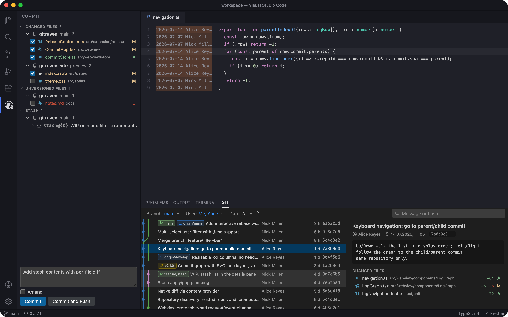
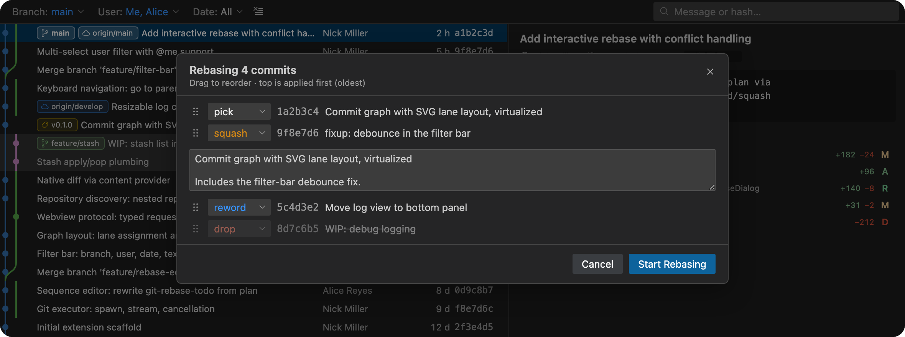
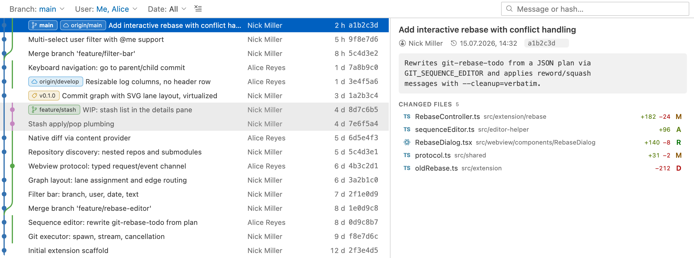

<p align="center">
  
</p>

<p align="center">
  A git client for VS Code: commit graph, multi-repository support,
  and a real interactive rebase.
</p>

<p align="center">
  <a href="https://marketplace.visualstudio.com/items?itemName=mi11er.gitraven"></a>
  
  
  
  
</p>

---

GitRaven is the git log VS Code deserves: a readable graph across every branch, instant
filters, and an interactive rebase you can actually trust — native look, native diff,
system `git` underneath.

Like Odin's ravens Huginn and Muninn, GitRaven flies out to your remotes and brings the whole
story back: every branch, every commit, remembered.

<p align="center">
  
</p>

## Features

- **Commit graph** — an SVG lane graph across all branches with ref badges (branches, remotes,
  tags), author, date and hash, virtualized to stay smooth on histories of thousands of commits.
  Columns resize by grabbing the invisible boundary between them — no clutter.
- **Keyboard-first log** — ↑/↓ walk the list; ←/→ jump to the child / parent commit, following
  the graph across interleaved branches (also available on the context menu).
- **Interactive rebase** — a visual dialog: drag to reorder, pick / reword / edit /
  squash / fixup / drop per commit. Implemented over `git rebase -i` with a custom
  `GIT_SEQUENCE_EDITOR`, so reword/squash messages apply deterministically without a blocking
  editor. Conflicts surface a banner with a progress bar and Continue / Skip / Abort.
- **Log filters** — branch, multiple users (`@me` included), date presets or a custom range,
  free-text / hash search.
- **Commit view** — a dedicated view in the activity bar: changed and unversioned files with
  checkboxes, grouped per repository, and a commit scoped to exactly the checked files. Amend,
  Commit and Push, stage/unstage/rollback right on the rows — plus a **stash** section with
  apply / pop / drop and expandable per-file contents.
- **Commit actions** — checkout, new branch/tag, cherry-pick, revert, rebase-onto, reset
  (soft / mixed / hard), copy sha/subject — all on the commit's context menu.
- **Multi-repository** — discovers every repo in the workspace, nested repos and submodules
  included; per-repo colour strips keep them apart in a combined log.
- **Native everything** — VS Code's own diff editor, theme tokens (light / dark / high-contrast),
  codicons, QuickPick/InputBox for prompts. No foreign-looking UI.
- **Lives anywhere** — wide in the bottom panel (log and details side by side); moved to a side
  bar it goes portrait and stacks them vertically.
- **Live updates** — file-system watchers on each repo's `.git` and on the working tree keep
  the views fresh, including changes made outside VS Code (CLI tools, scripts, agents).

### Interactive rebase

Reorder, squash, reword and drop with a dialog — no `git-rebase-todo` hand-editing:

<p align="center">
  
</p>

### Every theme, light or dark

All colors come from your theme's tokens — no hardcoded palette:

<p align="center">
  
</p>

## Getting started

Install **GitRaven** from the
[VS Code Marketplace](https://marketplace.visualstudio.com/items?itemName=mi11er.gitraven)
(or [Open VSX](https://open-vsx.org/extension/mi11er/gitraven) for VSCodium and friends) —
in the Extensions view just search for "GitRaven".

Open any folder containing git repositories: the log lives in the **Git** view in the
bottom panel, committing and stashes in the **Commit** view in the activity bar.

To run from source instead, clone the repo, then:

```sh
npm install
npm run build
```

and press **F5** ("Run GitRaven Extension") — an Extension Development Host starts with
the extension loaded.

## Keyboard reference

| Keys | Action |
| --- | --- |
| ↑ / ↓ | Previous / next commit in display order |
| ← / → | Go to child / parent commit (follows the graph) |
| Right-click | Commit actions menu |
| Double-click the graph column boundary | Reset graph column to auto width |

## Architecture

- **Extension host** (TypeScript/Node) is the single source of truth. It shells out to the
  system `git` CLI (`src/extension/git`), computes the graph layout
  (`src/extension/graph/layout.ts`), and serves the webview.
- **Webview** (React + TypeScript, bundled by esbuild) renders the UI and talks to the host over
  a typed `postMessage` protocol (`src/shared/protocol.ts`).
- **Editor helpers** (`src/editor-helper`) are tiny Node scripts used as `GIT_SEQUENCE_EDITOR` /
  `GIT_EDITOR` during interactive rebase.
- **Diffs** reuse VS Code's native diff editor via a `gitraven-git:` content provider.

See `src/shared/model.ts` for the data model.

## Development

```sh
npm run watch        # incremental rebuild of all three bundles
npm test             # vitest: parsers, graph layout, navigation, webview mount + real-git tests
npm run typecheck    # extension + webview tsconfigs
npm run lint
```

Tests that exercise git behavior run against a real `git` binary in temp repositories — no
mocks. If you change anything git-facing, please add one.

Describe user-visible changes under `## Unreleased` in CHANGELOG.md as you land them. To
release: `npm version <patch|minor|major> && git push --follow-tags` — the version hook stamps
the Unreleased section with the version and date, and CI publishes to the marketplaces with
that section as the release notes.

## Contributing

Issues and PRs are welcome. Keep changes small and focused; make sure `npm run typecheck` and
`npm test` pass. UI changes should use VS Code theme tokens (`--vscode-*`) and codicons — no
hardcoded colors, no emoji glyphs.

## Roadmap

See [BACKLOG.md](BACKLOG.md) for the prioritized backlog. Highlights: an operation journal
with one-click **Undo** for history rewrites, path filters and pickaxe search, a branches
panel, and multi-select commit operations.

## License

[MIT](LICENSE)
